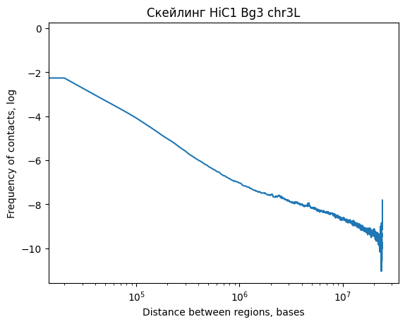

# hse23_hw4

Работа выполнена в Google Colaboratory.

https://colab.research.google.com/drive/12kYsILLag4ObJkHm9cRUaZ8CqLLeormv?usp=sharing

Копия ноутбука сохранена в папке src.

Комментарии к коду написаны в ноутбуке.

## Предварительный анализ данных Hi-C
### Построение графика скейлинга для одного из образцов в логарифмических координатах
#### 1. Построение графиков скейлинга отдельно для каждой хромосомы образца

chrX

chr2L

chr2R

chr3L

chr3R

chr4

#### 2. Построение графика скейлинга для усреднения по хромосомам.

Графики скейлинга позволяют сделать вывод, что расположенные ближе области хроматина взаимодействуют между собой чаще отдаленных, т.е. корреляцию между дистанцией и логарифмом частоты взаимодействия можно аппроксимировать линейно.

### Построение дендрограммы реплик Hi-C для клеточных линий дрозофилы bg3 (нервная ткань) и kc167 (эмбриональная линия) на основе коэффициента SCC

Дендрограмма позволяет сделать вывод, что реплики bg3 наиболее близки между собой, чуть менее близки между собой реплики kc167, дистанция между усреднёнными bg3 и kc167 в ~3 раза больше дистанции между репликами для клеточных линий.

Данная картина позволяет сделать вывод о сходстве между репликами и существенной разнице между картинами для разных клеточных линий.
